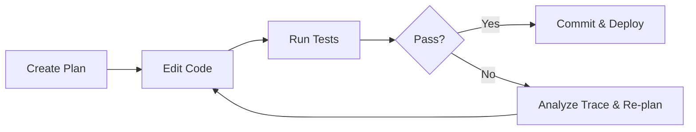

The landscape of software development is undergoing its most profound shift since the inception of high-level programming languages. We are moving from simple code auto-completion towards **fully autonomous, goal-directed AI coding systems**.

Rather than operating as autocomplete widgets that predict the next token, modern agents synthesize entire architectures, orchestrate test suites, fix runtime errors in isolated virtual environments, and submit clean pull requests.

## The Paradigm Shift: From Copilot to Autopilot

Early AI developer tooling operated largely in an interactive suggestion loop:
1. You typed a function signature.
2. The model suggested the body.
3. You reviewed and debugged the syntax.

Autonomous agents flip this dynamic on its head. Given a high-level user specification:

$$S = \{ \text{Goal}, \text{Constraints}, \text{Acceptance Tests} \}$$

The agent formulates a multi-step execution plan, queries the codebase using semantic and lexical search, modifies files across directories, and verifies build integrity.

### Comparing Traditional vs. Agentic Development

| Characteristic | Traditional Development | AI Copilot (2023-2024) | Autonomous Agents (2026+) |
| :--- | :--- | :--- | :--- |
| **Input** | Manual code writing | Inline prompts / snippets | High-level PR goals & Jira issues |
| **Scope** | Single file / function | Single function | Entire repository context |
| **Error Handling** | Human developer fixes bugs | Human prompts for fixes | Self-evaluating diagnostic loops |
| **Deployment** | Manual CI trigger | Manual CI trigger | Autonomous staging validation |

## Core Architectural Components of Modern Agents

Modern agents like Antigravity operate on a layered cognitive architecture:

### 1. Context Synthesis & Repository Indexing
Modern codebases frequently exceed several million tokens. Agents utilize ripgrep-style regex matching, symbol-graph AST parsing, and embeddings to identify precise file slices without polluting context windows.

```typescript
// Conceptual interface for an agentic tool call
interface CodebaseQuery {
  pattern: string;
  scope: 'workspace' | 'symbol' | 'dependency';
  maxMatches?: number;
}
```

### 2. The Self-Correction Feedback Loop
When an agent edits a file, it does not stop at writing characters. It invokes compiler diagnostics, runs automated unit tests, and parses stderr logs. If a test fails, the agent inspects the stack trace and iterates until tests pass.



## What This Means for Developers

Software engineers are rapidly transforming into **System Orchestrators** and **Product Architects**:
- **Design over Syntax:** Engineers spend more time defining invariants, boundary conditions, and domain data models.
- **Velocity Acceleration:** Solo founders can now build full-stack enterprise applications that previously required teams of ten engineers.
- **Continuous Quality:** Code review moves from nitpicking syntax to auditing high-level security assumptions and product intuition.

## Looking Ahead

As agent swarms continue to mature, the barrier between an idea and a globally accessible web application will diminish toward zero. Those who master orchestrating agentic tools will shape the next generation of computing.
